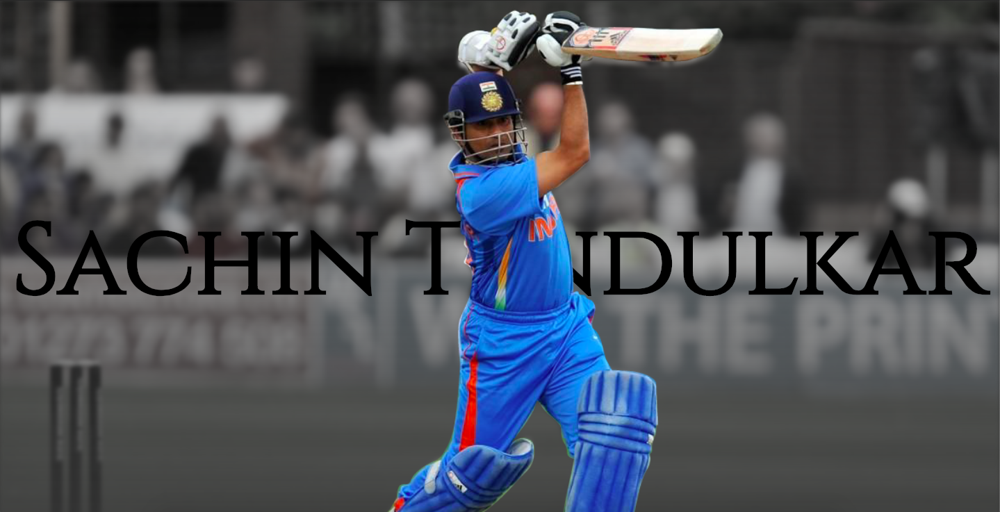

# SocialSachin

</img>

## **Sachin is the god of cricket. Is he really?** [Find Out](https://soicalsachin.firebaseapp.com)

## Description

As the most of the data in the project was static I couldn't include many features of an SPA such as state management or eventbus. Although I've used props to make each chart component as concise as possible. Their is a router-view on the home page which has some unconventianal navigation as i wanted the stats to be conveyed as a story not broken into different pages.

## Libraries used:-

- Vue.js
- Vue-Chartjs
- Vue-router

# Research for Master-Blaster

## Description

So this markdown contains the research and data I've pulled out of sites for this project. As I never was a fan of cricket so I really don't know how to judge a cricketer.

> I have no idea about cricket and cricketers.

So this doc serves as a todo board,brainstorming area and factual bulletin.

## Approach

- Collect and show the data about Sachin Tendulkar seperately.
- Compare and contrast it with other cricketers of that and this era.
  - Giving suitable favour to condition of cricket at that point of time.
- Emphasis on the **GOD factor**.

## Inpiration links

- https://www.viratkohli.club/home [For the hero-section]
- https://smashdelta.com/smartcities [For the dynamic charts representation]
- https://gigadom.in/2015/07/04/introducing-cricketr-a-r-package-to-analyze-performances-of-cricketers/ [For Sachin career anlysis]

## Data Points

- sachin.csv [provieded by you]
- ESPN cricinfo API [__Saved this whole project__]
- https://www.news18.com/cricketnext/news/sachin-tendulkar-or-virat-kohli-who-is-the-superior-odi-batsman-1920179.html
- https://www.news18.com/cricketnext/news/stats-reveal-sachin-is-virat-in-odi-knockout-matches-1224080.html
- https://decisionstats.com/2012/04/07/cricinfo-statsguru-database-for-statistical-and-graphical-analysis/

## Key features:-

- Made a unique anmation to lead user through the site like a story book not like conventional nav bar.
- Wrote the whole css by myself.

### Code base Specials:-

- Made chartComponents into a component module by introducing a index.js. So all the charts can be destructured from the chartComponents module within the same export LOC.
- The hero section comprises of two different mages processed and animated through CSS only.

## Project setup

```
npm install
npm run serve
```
